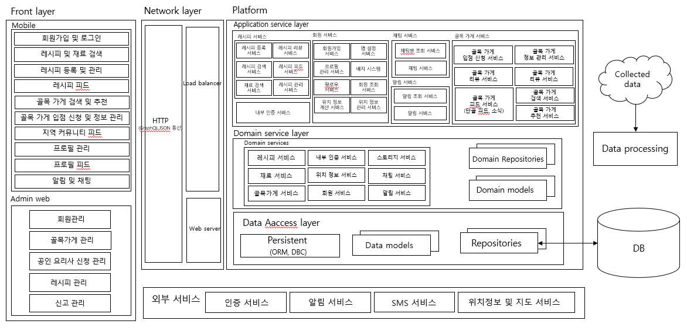
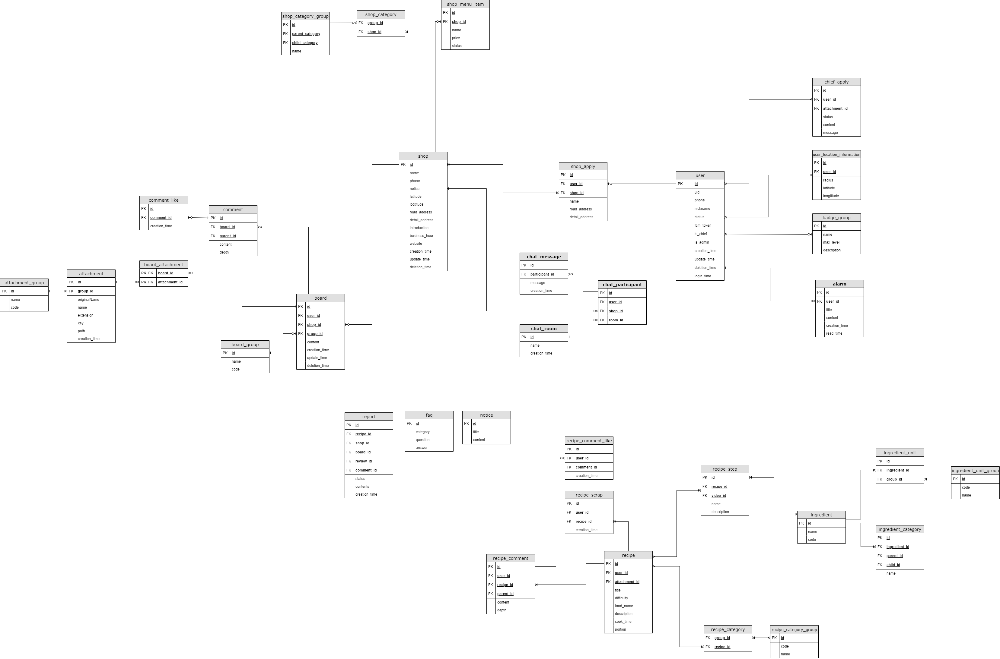

## Table of Conents

- [Outline](#outline)
- [Description](#description)
- [Requirements](#requirements)
- [Installation](#installation)
- [Running the app](#running-the-app)
- [Stay in touch](#stay-in-touch)

## Outline

본 프로젝트는 2021년도 원티드에서 주최한 해,커리어 참여작입니다.

## Description

### 시스템 구성도



### ERD



## Requirements

- Database

본 프로젝트는 [Prisma2](https://www.prisma.io/)를 사용합니다. 구체적인 데이터베이스의 제한사항은 없지만, 개발에는 MySQL을 활용하고 사용 중입니다.

- Twilio

문자 인증 서비스 구현을 위해 Twilio SDK를 활용합니다. 따라서 Twilio에서 발급 받은 번호와 Credential이 필요 합니다.

- Firebase

시스템의 전반적인 사용자 인증은 Firebase Auth 기반으로 구축되었습니다.

- .env.example

프로젝트를 실행하기 위해서는 위에서 언급한 데이터베이스, Firebase Admin Account Credential, Twilio Credential, 스토리지 정보 등을 .env 파일에 입력해야 합니다.

```
DATABASE_URL="mysql://<db-username>:<db-password>@localhost:3306/<db-name>?schema=public"

GOOGLE_APPLICATION_CREDENTIAL="firebase-service-account.json"

TWILIO_ACCOUNT_SID="<twilio-account-sid>"
TWILIO_AUTH_TOKEN="<twilio-auth-token>"
TWILIO_PHONE_NUMBER = '<twilio-phone-number>'

STORAGE_PROTOCOL="http"
STORAGE_HOST="localhost"
STORAGE_PORT="3000"
```

## Installation

```bash
$ npm install
$ npx prisma generate
```

## Running the app

```bash
# development
$ npm run start

# watch mode
$ npm run start:dev

# production mode
$ npm run start:prod
```

## Stay in touch

- Author - [Jaeyun Cha](https://notjustmoney.github.io)
